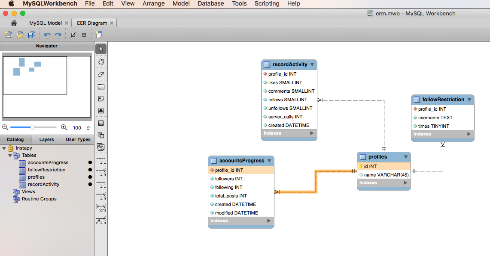

## InstaPy Database

The [erm.mwb](./erm.mwb) file is a MySQL workbench file to represent database design. 
In order to load the file you need to first install [MySQL Workbench](https://www.mysql.com/products/workbench/).

This file holds the oerm schema of the instapy.db.
The idea is, everytime we update the database, we also update the "design". 
This will allow future contributors to understand the relations and find it easier to work with the database.

> Please note that this image might be outdated and is only supposed to show the structure of the MySQL workbench planning tool

